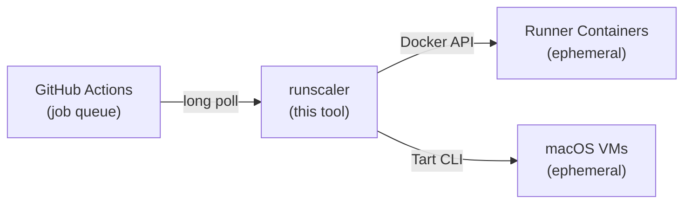

# runscaler

[](https://github.com/ysya/runscaler/releases)
[](https://go.dev)
[](LICENSE)
[](https://goreportcard.com/report/github.com/ysya/runscaler)

Auto-scale GitHub Actions self-hosted runners as Docker containers or macOS VMs. Powered by [actions/scaleset](https://github.com/actions/scaleset).

Runners are **ephemeral** — each container/VM handles exactly one job and is removed upon completion. No Kubernetes required.

## How It Works



1. Registers a [runner scale set](https://docs.github.com/en/actions/hosting-your-own-runners/managing-self-hosted-runners-with-actions-runner-controller/about-actions-runner-controller) with GitHub
2. Long-polls for job assignments via the scaleset API
3. Spins up Docker containers or macOS VMs with JIT (just-in-time) runner configs
4. Removes containers/VMs automatically when jobs complete
5. Cleans up all resources and the scale set on shutdown

## Features

- **Zero Kubernetes** — runs directly on any Docker host or Apple Silicon Mac
- **Ephemeral runners** — each job gets a fresh container/VM, no state leakage
- **Auto-scaling** — scales from 0 to N based on job demand via long-poll (no cron, no polling delay)
- **Docker-in-Docker** — optional DinD support for workflows that build containers
- **macOS VMs via Tart** — native Apple Virtualization.framework with APFS Copy-on-Write cloning
- **VM warm pool** — pre-boot macOS VMs for instant job pickup (~2s vs ~30s cold boot)
- **Shared volumes** — cross-runner caching via named Docker volumes
- **Multi-org support** — manage multiple scale sets from a single process, mix Docker and Tart backends
- **Single binary** — no runtime dependencies beyond Docker (or Tart for macOS)
- **Config file or flags** — TOML config with CLI flag overrides

## Quick Start

### Prerequisites

- **Docker backend:** Docker running on the host
- **Tart backend (macOS):** Apple Silicon Mac with [Tart](https://tart.run/) installed:

  ```bash
  brew install cirruslabs/cli/tart

  # Pull a macOS runner image (pre-installed with Xcode and runner dependencies)
  tart pull ghcr.io/cirruslabs/macos-tahoe-xcode:latest
  ```

  > **Note:** Apple's Virtualization.framework limits each host to **2 concurrent macOS VMs**. Set `max-runners` accordingly.

- A GitHub **Personal Access Token** — required scopes depend on token type and runner level:

  | Token type           | Organization runners                                               | Repository runners                 |
  | -------------------- | ------------------------------------------------------------------ | ---------------------------------- |
  | **Classic PAT**      | `admin:org`                                                        | `repo`                             |
  | **Fine-grained PAT** | Self-hosted runners: **Read and write** + Administration: **Read** | Administration: **Read and write** |

  > **Note:** The token owner must be an **org owner** (for org runners) or have **admin access** to the repo (for repo runners). Fine-grained PATs targeting an organization may also require [admin approval](https://docs.github.com/en/organizations/managing-programmatic-access-to-your-organization/setting-a-personal-access-token-policy-for-your-organization) depending on org policy.

### Install

**Shell script (Linux/macOS):**

```bash
curl -fsSL https://raw.githubusercontent.com/ysya/runscaler/main/install.sh | sh
```

You can set `INSTALL_DIR` to customize the install location, or `RUNSCALER_VERSION` to pin a version:

```bash
curl -fsSL https://raw.githubusercontent.com/ysya/runscaler/main/install.sh | INSTALL_DIR=./bin sh
```

**Go install:**

```bash
go install github.com/ysya/runscaler@latest
```

**Binary releases:**

Download from [Releases](https://github.com/ysya/runscaler/releases) and add to your `PATH`.

### Run

```bash
# Generate config interactively
runscaler init

# Validate everything before starting
runscaler validate --config config.toml

# Start scaling
runscaler --config config.toml

# Or using CLI flags directly
runscaler \
  --url https://github.com/your-org \
  --name my-runners \
  --token ghp_xxx \
  --max-runners 10

# Dry run — validate config, Docker, and images without starting listeners
runscaler --dry-run --config config.toml
```

Then in your workflow:

```yaml
jobs:
  build:
    runs-on: my-runners  # matches --labels (defaults to --name if not set)
    steps:
      - uses: actions/checkout@v4
      - run: echo "Running on auto-scaled runner!"
```

## Commands

| Command              | Description                                    |
| -------------------- | ---------------------------------------------- |
| `runscaler`          | Start the auto-scaler (default)                |
| `runscaler init`     | Generate a config file interactively           |
| `runscaler validate` | Validate configuration and connectivity        |
| `runscaler status`   | Show current runner status via health endpoint |

## Configuration

Configuration can be provided via a TOML config file (`--config`) or CLI flags. When both are provided, CLI flags take priority over config file values.

### Config File (TOML)

**Docker backend (default):**

```toml
# config.toml
url = "https://github.com/your-org"
name = "my-runners"
token = "ghp_xxx"
max-runners = 10
min-runners = 0
labels = ["self-hosted", "linux"]
runner-image = "ghcr.io/actions/actions-runner:latest"
runner-group = "default"
docker-socket = "/var/run/docker.sock"
dind = true
shared-volume = "/shared"
log-level = "info"
log-format = "text"
```

**Tart backend (macOS):**

```toml
# config.toml
backend = "tart"
url = "https://github.com/your-org"
name = "macos-runners"
token = "ghp_xxx"
max-runners = 2          # Apple limits 2 concurrent macOS VMs per host
labels = ["self-hosted", "macOS"]
tart-image = "ghcr.io/cirruslabs/macos-tahoe-xcode:latest"
tart-ssh-user = "admin"  # default
tart-ssh-pass = "admin"  # default
tart-runner-dir = "/Users/admin/actions-runner"  # default
tart-pool-size = 2       # pre-warm 2 VMs for instant job pickup (~2s vs ~30s cold boot)
# tart-softnet = true    # requires: sudo chmod u+s $(which softnet)
log-level = "info"
```

### Token Security

Avoid passing tokens as CLI flags (visible in `ps` output). Two alternatives:

**Option 1: `RUNSCALER_TOKEN` environment variable** — automatically used when no `--token` flag or config value is set:

```bash
export RUNSCALER_TOKEN=ghp_xxx
runscaler --url https://github.com/org --name my-runners
```

**Option 2: `env:` syntax in config file** — reference any environment variable by name:

```toml
token = "env:GITHUB_TOKEN"  # reads from $GITHUB_TOKEN at startup
```

Priority: `--token` flag > `RUNSCALER_TOKEN` env var > config file value (including `env:` resolution).

**Multiple scale sets (mixed Docker + Tart):**

```toml
# Global settings
runner-image = "ghcr.io/actions/actions-runner:latest"
runner-group = "default"
max-runners = 10
log-level = "info"

# Each [[scaleset]] runs independently.
# Inherits global settings if omitted.

[[scaleset]]
url = "https://github.com/your-org"
name = "linux-runners"
token = "ghp_aaa"
docker-socket = "/var/run/docker.sock"
dind = true

[[scaleset]]
backend = "tart"
url = "https://github.com/your-org"
name = "macos-runners"
token = "ghp_bbb"
tart-image = "ghcr.io/cirruslabs/macos-tahoe-xcode:latest"
max-runners = 2
labels = ["self-hosted", "macOS"]
tart-pool-size = 2
```

### CLI Flags

| Flag                | Default                                 | Description                                       |
| ------------------- | --------------------------------------- | ------------------------------------------------- |
| `--config`          |                                         | Path to TOML config file                          |
| `--url`             | (required)                              | Registration URL (org or repo)                    |
| `--name`            | (required)                              | Scale set name (used as `runs-on` label)          |
| `--token`           | (required)                              | GitHub Personal Access Token                      |
| `--backend`         | `docker`                                | Runner backend (`docker` or `tart`)               |
| `--max-runners`     | `10`                                    | Maximum concurrent runners                        |
| `--min-runners`     | `0`                                     | Minimum runners to keep warm                      |
| `--labels`          | `<name>`                                | Runner labels (comma-separated)                   |
| `--runner-group`    | `default`                               | Runner group name                                 |
| `--runner-image`    | `ghcr.io/actions/actions-runner:latest` | Docker image (Docker backend)                     |
| `--docker-socket`   | `/var/run/docker.sock`                  | Docker socket path (Docker backend)               |
| `--dind`            | `true`                                  | Mount Docker socket into runners (Docker backend) |
| `--shared-volume`   |                                         | Shared Docker volume path (Docker backend)        |
| `--tart-image`      |                                         | Tart VM image name (Tart backend, required)       |
| `--tart-ssh-user`   | `admin`                                 | SSH user for Tart VMs                             |
| `--tart-ssh-pass`   | `admin`                                 | SSH password for Tart VMs                         |
| `--tart-runner-dir` | `/Users/admin/actions-runner`           | Runner install directory inside Tart VM           |
| `--tart-softnet`    | `false`                                 | Use softnet for network isolation (Tart backend)  |
| `--tart-pool-size`  | `0`                                     | Number of pre-warmed VMs for instant job pickup   |
| `--log-level`       | `info`                                  | Log level (debug/info/warn/error)                 |
| `--log-format`      | `text`                                  | Log format (text/json)                            |
| `--dry-run`         | `false`                                 | Validate everything without starting listeners    |
| `--health-port`     | `8080`                                  | Health check HTTP port (0 to disable)             |

## Deployment

### Systemd

```ini
[Unit]
Description=GitHub Actions Runner Auto-Scaler
After=docker.service
Requires=docker.service

[Service]
Type=simple
ExecStart=/usr/local/bin/runscaler --config /etc/runscaler/config.toml
Restart=on-failure
RestartSec=10s

[Install]
WantedBy=multi-user.target
```

## Building

```bash
# Current platform
make build

# All platforms (linux/amd64, linux/arm64, darwin/amd64, darwin/arm64)
make all
```

## Architecture

Built on top of [actions/scaleset](https://github.com/actions/scaleset), the official Go client library for GitHub Actions Runner Scale Sets.

Key components:

```
cmd/runscaler/       CLI entry point, commands (init, validate, status)
internal/
  config/            Configuration management with Viper (flags + TOML)
  backend/           RunnerBackend interface + Docker/Tart implementations
  scaler/            Implements listener.Scaler for runner lifecycle
  health/            Health check HTTP server
```

The `RunnerBackend` interface abstracts container/VM lifecycle:

- **`DockerBackend`** — manages runner containers via Docker API
- **`TartBackend`** — manages macOS VMs via Tart CLI (clone → run → SSH → stop → delete)

The scaler implements three methods from the scaleset `Scaler` interface:

- `HandleDesiredRunnerCount` — Scales up runners to match job demand
- `HandleJobStarted` — Marks runners as busy
- `HandleJobCompleted` — Removes finished runners

## License

MIT
