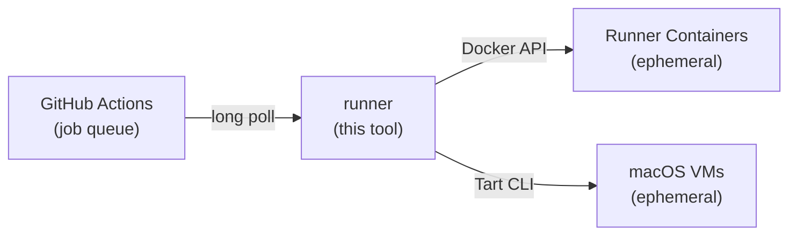

# runner

[](https://github.com/ysya/runscaler/releases)
[](https://go.dev)
[](LICENSE)
[](https://goreportcard.com/report/github.com/ysya/runscaler)

Auto-scale GitHub Actions self-hosted runners as Docker containers or macOS VMs. Powered by [actions/scaleset](https://github.com/actions/scaleset).

Runners are **ephemeral** — each container/VM handles exactly one job and is removed upon completion. No Kubernetes required.

## Table of Contents

- [How It Works](#how-it-works)
- [Features](#features)
- [Quick Start](#quick-start)
  - [Prerequisites](#prerequisites)
  - [Install](#install)
  - [Run](#run)
- [Commands](#commands)
  - [Updating](#updating)
- [Configuration](#configuration)
  - [Config File (TOML)](#config-file-toml)
  - [Token Security](#token-security)
  - [CLI Flags](#cli-flags)
- [Deployment](#deployment)
- [Building](#building)
- [Architecture](#architecture)
- [Upgrading from runscaler](#upgrading-from-runscaler)
- [License](#license)

## How It Works



1. Registers a [runner scale set](https://docs.github.com/en/actions/hosting-your-own-runners/managing-self-hosted-runners-with-actions-runner-controller/about-actions-runner-controller) with GitHub
2. Long-polls for job assignments via the scaleset API
3. Spins up Docker containers or macOS VMs with JIT (just-in-time) runner configs
4. Removes containers/VMs automatically when jobs complete
5. Cleans up all resources and the scale set on shutdown

## Features

- **Zero Kubernetes** — runs directly on any Docker host or Apple Silicon Mac
- **Ephemeral runners** — each job gets a fresh container/VM, no state leakage
- **Auto-scaling** — scales from 0 to N based on job demand via long-poll (no cron, no polling delay)
- **Docker-in-Docker** — optional DinD support for workflows that build containers
- **macOS VMs via Tart** — native Apple Virtualization.framework with APFS Copy-on-Write cloning
- **VM warm pool** — pre-boot macOS VMs for instant job pickup (~2s vs ~30s cold boot)
- **Shared volumes** — cross-runner caching via named Docker volumes
- **Multi-org support** — manage multiple scale sets from a single process, mix Docker and Tart backends
- **Single binary** — no runtime dependencies beyond Docker (or Tart for macOS)
- **Config file or flags** — TOML config with CLI flag overrides

## Quick Start

### Prerequisites

- **Docker backend:** Docker running on the host
- **Tart backend (macOS):** Apple Silicon Mac with [Tart](https://tart.run/) installed:

  ```bash
  brew install cirruslabs/cli/tart

  # Pull a macOS runner image (pre-installed with Xcode and runner dependencies)
  tart pull ghcr.io/cirruslabs/macos-tahoe-xcode:latest
  ```

  > **Note:** Apple's Virtualization.framework limits each host to **2 concurrent macOS VMs**. Set `max-runners` accordingly. Each VM slot is assigned a deterministic MAC address to prevent DHCP lease exhaustion — no sudo required.

  The default VM resources from Cirrus Labs images:

  | Image | CPU | Memory | Disk |
  | ----- | --- | ------ | ---- |
  | `ghcr.io/cirruslabs/macos-tahoe-xcode:latest` | 4 cores | 8 GB (8192 MB) | 120 GB |
  | `ghcr.io/cirruslabs/macos-sequoia-xcode:latest` | 4 cores | 8 GB (8192 MB) | 120 GB |

  Override per VM with `cpu` and `memory` under `[tart]` in config. For iOS builds (Xcode), 8 GB+ is recommended.

- A GitHub **Personal Access Token** — required scopes depend on token type and runner level:

  | Token type           | Organization runners                                               | Repository runners                 |
  | -------------------- | ------------------------------------------------------------------ | ---------------------------------- |
  | **Classic PAT**      | `admin:org`                                                        | `repo`                             |
  | **Fine-grained PAT** | Self-hosted runners: **Read and write** + Administration: **Read** | Administration: **Read and write** |

  > **Note:** The token owner must be an **org owner** (for org runners) or have **admin access** to the repo (for repo runners). Fine-grained PATs targeting an organization may also require [admin approval](https://docs.github.com/en/organizations/managing-programmatic-access-to-your-organization/setting-a-personal-access-token-policy-for-your-organization) depending on org policy.

### Install

**Shell script (Linux/macOS):**

```bash
curl -fsSL https://raw.githubusercontent.com/ysya/runscaler/main/install.sh | sh
```

Installs to `~/.local/bin` by default (no sudo required). Set `INSTALL_DIR` to customize, or `RUNNER_VERSION` to pin a version:

```bash
# Install to a custom location (e.g. system-wide)
curl -fsSL https://raw.githubusercontent.com/ysya/runscaler/main/install.sh | INSTALL_DIR=/usr/local/bin sh

# Pin a specific version
curl -fsSL https://raw.githubusercontent.com/ysya/runscaler/main/install.sh | RUNNER_VERSION=v1.2.3 sh
```

**Go install:**

```bash
go install github.com/ysya/runscaler/cmd/runner@latest
```

**Binary releases:**

Download from [Releases](https://github.com/ysya/runscaler/releases) and add to your `PATH`.

### Run

```bash
# Generate config interactively
runner init

# Validate everything before starting
runner validate --config config.toml

# Start scaling
runner run --config config.toml

# Or using CLI flags directly
runner run \
  --url https://github.com/your-org \
  --name my-runners \
  --token ghp_xxx \
  --max-runners 10

# Dry run — validate config, Docker, and images without starting listeners
runner run --dry-run --config config.toml
```

Then in your workflow:

```yaml
jobs:
  build:
    runs-on: my-runners  # matches --labels (defaults to --name if not set)
    steps:
      - uses: actions/checkout@v4
      - run: echo "Running on auto-scaled runner!"
```

## Commands

| Command                  | Description                                            |
| ------------------------ | ------------------------------------------------------ |
| `runner run`             | Start the auto-scaler                                  |
| `runner init`            | Generate a config file interactively                   |
| `runner validate`        | Validate configuration and connectivity                |
| `runner status`          | Show current runner status via health endpoint         |
| `runner doctor`          | Diagnose and clean up orphaned containers/VMs          |
| `runner version`         | Show version, commit, build date, and runtime info     |
| `runner update`          | Update runner to the latest release                    |
| `runner update --check`  | Check for updates without installing                   |

### Updating

```bash
# Update to the latest release (downloads, verifies checksum, replaces binary in-place)
runner update

# Check if a newer version is available without installing
runner update --check
```

`runner update` downloads the archive for your platform, verifies its SHA-256 checksum against the release's `checksums.txt`, then atomically replaces the running binary. Restart runner after updating.

### Troubleshooting with `doctor`

If runner is killed unexpectedly (e.g. `kill -9`, crash, power loss), Docker containers or Tart VMs may be left behind. Use `doctor` to detect and clean them up:

```bash
# Check for orphaned resources
runner doctor

# Auto-remove orphaned containers, VMs, and volumes
runner doctor --fix
```

The `--fix` flag will refuse to run if runner is currently active (detected via health endpoint), preventing accidental removal of in-use resources.

## Configuration

Configuration can be provided via a TOML config file (`--config`) or CLI flags. When both are provided, CLI flags take priority over config file values.

### Config File (TOML)

**Docker backend (default):**

```toml
# config.toml
url = "https://github.com/your-org"
name = "my-runners"
token = "ghp_xxx"
max-runners = 10
min-runners = 0
labels = ["self-hosted", "linux"]
runner-image = "ghcr.io/actions/actions-runner:latest"
runner-group = "default"
log-level = "info"
log-format = "text"

[docker]
socket = "/var/run/docker.sock"
dind = true
shared-volume = "/shared"
# shared-volume-ttl = "168h"            # delete shared-volume files older than this (0 = disabled)
# buildx-cleanup = true                 # remove orphaned buildx builders (default: on)
# buildx-cleanup-ttl = "24h"            # remove buildx builders older than this
# buildx-cleanup-interval = "6h"        # how often the buildx sweep runs
```

When runners build images with `docker buildx` (e.g. via
`docker/setup-buildx-action`), each run can leave behind a BuildKit builder
container plus a multi-GB `buildx_buildkit_*_state` volume. On a persistent host
sharing one Docker daemon these accumulate until the disk fills. runner
removes builders older than `buildx-cleanup-ttl` on a timer — the TTL is kept
well above any realistic build so in-progress builds are never disrupted.
Disable with `buildx-cleanup = false` only if you run a persistent builder via
buildx `keep-state` + a fixed builder name.

**Tart backend (macOS):**

```toml
# config.toml
backend = "tart"
url = "https://github.com/your-org"
name = "macos-runners"
token = "ghp_xxx"
max-runners = 2          # Apple limits 2 concurrent macOS VMs per host
runner-image = "ghcr.io/cirruslabs/macos-tahoe-xcode:latest"
labels = ["self-hosted", "macOS"]
log-level = "info"

[tart]
cpu = 4                  # CPU cores per VM (0 = use image default)
memory = 8192            # Memory in MB per VM (0 = use image default)
runner-dir = "/Users/admin/actions-runner"  # default
pool-size = 2            # pre-warm 2 VMs for instant job pickup (~2s vs ~30s cold boot)
# home = "/Volumes/Data/tart"          # TART_HOME for the tart CLI ("" = ~/.tart)
# cache-space-budget = 80              # cap OCI/IPSW cache to N GB via `tart prune` (0 = disabled)
# cache-cleanup-interval = "24h"       # how often the prune sweep runs
```

Xcode VM images are huge (50–80 GB each) and `:latest` tags accumulate old
layers under `$TART_HOME/cache/` — set `cache-space-budget` to keep it
bounded. The sweeper only touches OCI/IPSW caches, never your local VMs.

### Token Security

Avoid passing tokens as CLI flags (visible in `ps` output). Two alternatives:

**Option 1: `RUNNER_TOKEN` environment variable** — automatically used when no `--token` flag or config value is set (the old `RUNSCALER_TOKEN` name still works but is deprecated):

```bash
export RUNNER_TOKEN=ghp_xxx
runner run --url https://github.com/org --name my-runners
```

**Option 2: `env:` syntax in config file** — reference any environment variable by name:

```toml
token = "env:GITHUB_TOKEN"  # reads from $GITHUB_TOKEN at startup
```

Priority: `--token` flag > `RUNNER_TOKEN` env var > config file value (including `env:` resolution).

**Multiple scale sets (mixed Docker + Tart):**

```toml
# Global defaults (inherited by all scale sets)
runner-image = "ghcr.io/actions/actions-runner:latest"
runner-group = "default"
max-runners = 10
log-level = "info"

[docker]
socket = "/var/run/docker.sock"
dind = true

# Each [[scaleset]] runs independently.
# Inherits global settings if omitted.

[[scaleset]]
url = "https://github.com/your-org"
name = "linux-runners"
token = "ghp_aaa"

[[scaleset]]
backend = "tart"
url = "https://github.com/your-org"
name = "macos-runners"
token = "ghp_bbb"
max-runners = 2
runner-image = "ghcr.io/cirruslabs/macos-tahoe-xcode:latest"
labels = ["self-hosted", "macOS"]
[scaleset.tart]
pool-size = 2
```

### CLI Flags

| Flag                | TOML key             | Default                                 | Description                                       |
| ------------------- | -------------------- | --------------------------------------- | ------------------------------------------------- |
| `--config`          |                      |                                         | Path to TOML config file                          |
| `--url`             | `url`                | (required)                              | Registration URL (org or repo)                    |
| `--name`            | `name`               | (required)                              | Scale set name (used as `runs-on` label)          |
| `--token`           | `token`              | (required)                              | GitHub Personal Access Token                      |
| `--backend`         | `backend`            | `docker`                                | Runner backend (`docker` or `tart`)               |
| `--max-runners`     | `max-runners`        | `10`                                    | Maximum concurrent runners                        |
| `--min-runners`     | `min-runners`        | `0`                                     | Minimum runners to keep warm                      |
| `--labels`          | `labels`             | `<name>`                                | Runner labels (comma-separated)                   |
| `--runner-group`    | `runner-group`       | `default`                               | Runner group name                                 |
| `--runner-image`    | `runner-image`       | `ghcr.io/actions/actions-runner:latest` | Runner image (Docker image or Tart VM image)      |
| `--docker-socket`   | `[docker] socket`    | `/var/run/docker.sock`                  | Docker socket path (Docker backend)               |
| `--dind`            | `[docker] dind`      | `true`                                  | Mount Docker socket into runners (Docker backend) |
| `--shared-volume`   | `[docker] shared-volume` |                                     | Shared Docker volume path (Docker backend)        |
| `--tart-cpu`        | `[tart] cpu`         | `0` (image default)                     | CPU cores per VM (Tart backend)                   |
| `--tart-memory`     | `[tart] memory`      | `0` (image default)                     | Memory in MB per VM (Tart backend)                |
| `--tart-runner-dir` | `[tart] runner-dir`  | `/Users/admin/actions-runner`           | Runner install directory inside Tart VM           |
| `--tart-pool-size`  | `[tart] pool-size`   | `0`                                     | Number of pre-warmed VMs for instant job pickup   |
| `--log-level`       | `log-level`          | `info`                                  | Log level (debug/info/warn/error)                 |
| `--log-format`      | `log-format`         | `text`                                  | Log format (text/json)                            |
| `--dry-run`         | `dry-run`            | `false`                                 | Validate everything without starting listeners    |
| `--health-port`     | `health-port`        | `8080`                                  | Health check HTTP port (0 to disable)             |

## Deployment

### Systemd

```ini
[Unit]
Description=GitHub Actions Runner Auto-Scaler
After=docker.service
Requires=docker.service

[Service]
Type=simple
ExecStart=/usr/local/bin/runner run --config /etc/runner/config.toml
Restart=on-failure
RestartSec=10s

[Install]
WantedBy=multi-user.target
```

## Building

```bash
# Current platform
make build

# All platforms (linux/amd64, linux/arm64, darwin/amd64, darwin/arm64)
make all
```

## Architecture

Built on top of [actions/scaleset](https://github.com/actions/scaleset), the official Go client library for GitHub Actions Runner Scale Sets.

Key components:

```
cmd/runner/          CLI entry point, commands (run, init, validate, status, doctor, version)
internal/
  config/            Configuration management with Viper (flags + TOML)
  backend/           RunnerBackend interface + Docker/Tart implementations
  scaler/            Implements listener.Scaler for runner lifecycle
  health/            Health check HTTP server
  versioncheck/      GitHub releases API client for update notifications and in-place binary updates
```

The `RunnerBackend` interface abstracts container/VM lifecycle:

- **`DockerBackend`** — manages runner containers via Docker API
- **`TartBackend`** — manages macOS VMs via Tart CLI (clone → run → exec → stop → delete)

The scaler implements three methods from the scaleset `Scaler` interface:

- `HandleDesiredRunnerCount` — Scales up runners to match job demand
- `HandleJobStarted` — Marks runners as busy
- `HandleJobCompleted` — Removes finished runners

## Upgrading from runscaler

The `runscaler` binary is now `runner` (start is a subcommand: `runner run`).
After installing the new binary, run:

    sudo runner migrate          # system-level install
    runner migrate --user        # user-level install

`migrate` moves your config (`/etc/runscaler` → `/etc/runner`), reinstalls the
service under the new name, and removes the old docker volume. It is idempotent.

During the transition the old binary's `runscaler update` can still fetch this
release (compat assets are published), a legacy `/etc/runscaler/config.toml` is
still read (with a warning), and an old `runscaler --config` service invocation
still starts (with a warning) — so nothing breaks before you migrate.

Manual alternative: uninstall the old service with the old binary, move the
config, run `sudo runner service install`, and `runner doctor --fix` to clean
the old volume.

## License

MIT
