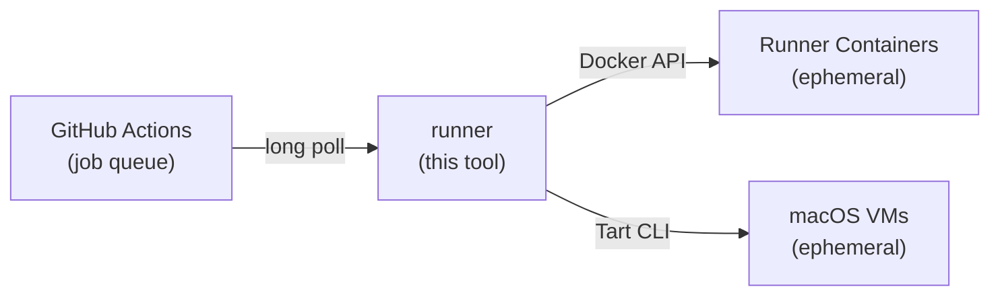

# runner

[](https://github.com/ysya/runscaler/releases)
[](https://go.dev)
[](LICENSE)
[](https://goreportcard.com/report/github.com/ysya/runscaler)

Auto-scale GitHub Actions self-hosted runners as Docker containers or macOS VMs. Powered by [actions/scaleset](https://github.com/actions/scaleset).

Runners are **ephemeral** — each container/VM handles exactly one job and is removed upon completion. No Kubernetes required.

## Table of Contents

- [How It Works](#how-it-works)
- [Features](#features)
- [Quick Start](#quick-start)
  - [Prerequisites](#prerequisites)
  - [Install](#install)
  - [Run](#run)
- [Commands](#commands)
  - [Updating](#updating)
- [Configuration](#configuration)
  - [Config File (TOML)](#config-file-toml)
  - [Token Security](#token-security)
  - [CLI Flags](#cli-flags)
- [Caching](#caching)
  - [What Can Be Reclaimed](#what-can-be-reclaimed)
  - [The Disk Guard](#the-disk-guard)
  - [Store Retention Settings](#store-retention-settings)
  - [Visibility](#visibility)
- [Security & Isolation](#security--isolation)
- [Deployment](#deployment)
  - [Graceful Shutdown](#graceful-shutdown)
- [Building](#building)
- [Architecture](#architecture)
- [Upgrading from runscaler](#upgrading-from-runscaler)
- [License](#license)

## How It Works


```mermaid
flowchart LR
    A["GitHub Actions<br/>(job queue)"] -- long poll --> B["runner<br/>(this tool)"]
    B -- Docker API --> C["Runner Containers<br/>(ephemeral)"]
    B -- Tart CLI --> D["macOS VMs<br/>(ephemeral)"]
```

1. Registers a [runner scale set](https://docs.github.com/en/actions/hosting-your-own-runners/managing-self-hosted-runners-with-actions-runner-controller/about-actions-runner-controller) with GitHub
2. Long-polls for job assignments via the scaleset API
3. Spins up Docker containers or macOS VMs with JIT (just-in-time) runner configs
4. Removes containers/VMs automatically when jobs complete
5. Drains in-flight jobs on a graceful stop and reconciles resources left by an abnormal stop at the next startup

## Features

- **Zero Kubernetes** — runs directly on any Docker host or Apple Silicon Mac
- **Ephemeral runners** — each job gets a fresh container/VM, no state leakage
- **Auto-scaling** — scales from 0 to N based on job demand via long-poll (no cron, no polling delay)
- **Docker-in-Docker** — optional DinD support for workflows that build containers
- **macOS VMs via Tart** — native Apple Virtualization.framework with APFS Copy-on-Write cloning
- **VM warm pool** — pre-boot macOS VMs for instant job pickup (~2s vs ~30s cold boot)
- **Shared volumes** — cross-runner caching via named Docker volumes
- **Multi-org support** — manage multiple scale sets from a single process, mix Docker and Tart backends
- **Self-healing capacity** — replace containers/VMs that exit before GitHub reports job completion
- **Safe restarts** — SIGTERM/SIGQUIT stop new work and wait for in-flight jobs; startup reclaims containers/VMs left by hard kills
- **Operational safety** — one process per host, localhost-only health checks, and built-in rotating logs
- **Single binary** — no runtime dependencies beyond Docker (or Tart for macOS)
- **Config file or flags** — TOML config with CLI flag overrides

## Quick Start

### Prerequisites

- **Docker backend:** Docker running on the host
- **Tart backend (macOS):** Apple Silicon Mac with [Tart](https://tart.run/) installed:

  ```bash
  brew install cirruslabs/cli/tart

  # Pull a macOS runner image (pre-installed with Xcode and runner dependencies)
  tart pull ghcr.io/cirruslabs/macos-tahoe-xcode:latest
  ```

  > **Note:** Apple's Virtualization.framework limits each host to **2 concurrent macOS VMs**. Set `max-runners` accordingly. Each VM slot is assigned a deterministic MAC address to prevent DHCP lease exhaustion — no sudo required.

  The default VM resources from Cirrus Labs images:

  | Image | CPU | Memory | Disk |
  | ----- | --- | ------ | ---- |
  | `ghcr.io/cirruslabs/macos-tahoe-xcode:latest` | 4 cores | 8 GB (8192 MB) | 120 GB |
  | `ghcr.io/cirruslabs/macos-sequoia-xcode:latest` | 4 cores | 8 GB (8192 MB) | 120 GB |

  Override per VM with `cpu` and `memory` under `[tart]` in config. For iOS builds (Xcode), 8 GB+ is recommended.

- A GitHub **Personal Access Token** — required scopes depend on token type and runner level:

  | Token type           | Organization runners                                               | Repository runners                 |
  | -------------------- | ------------------------------------------------------------------ | ---------------------------------- |
  | **Classic PAT**      | `admin:org`                                                        | `repo`                             |
  | **Fine-grained PAT** | Self-hosted runners: **Read and write** + Administration: **Read** | Administration: **Read and write** |

  > **Note:** The token owner must be an **org owner** (for org runners) or have **admin access** to the repo (for repo runners). Fine-grained PATs targeting an organization may also require [admin approval](https://docs.github.com/en/organizations/managing-programmatic-access-to-your-organization/setting-a-personal-access-token-policy-for-your-organization) depending on org policy.

### Install

**Shell script (Linux/macOS):**

```bash
curl -fsSL https://raw.githubusercontent.com/ysya/runscaler/main/install.sh | sh
```

Installs to `~/.local/bin` by default (no sudo required). Set `INSTALL_DIR` to customize, or `RUNNER_VERSION` to pin a version:

```bash
# Install to a custom location (e.g. system-wide)
curl -fsSL https://raw.githubusercontent.com/ysya/runscaler/main/install.sh | INSTALL_DIR=/usr/local/bin sh

# Pin a specific version
curl -fsSL https://raw.githubusercontent.com/ysya/runscaler/main/install.sh | RUNNER_VERSION=v1.2.3 sh
```

**Go install:**

```bash
go install github.com/ysya/runscaler/cmd/runner@latest
```

**Binary releases:**

Download from [Releases](https://github.com/ysya/runscaler/releases) and add to your `PATH`.

### Run

```bash
# Generate config interactively
runner init

# Validate everything before starting
runner validate --config config.toml

# Start scaling
runner run --config config.toml

# Or using CLI flags directly
runner run \
  --url https://github.com/your-org \
  --name my-runners \
  --token ghp_xxx \
  --max-runners 10

# Dry run — validate config, Docker, and images without starting listeners
runner run --dry-run --config config.toml
```

Then in your workflow:

```yaml
jobs:
  build:
    runs-on: my-runners  # matches --labels (defaults to --name if not set)
    steps:
      - uses: actions/checkout@v4
      - run: echo "Running on auto-scaled runner!"
```

## Commands

| Command                  | Description                                            |
| ------------------------ | ------------------------------------------------------ |
| `runner run`             | Start the auto-scaler                                  |
| `runner init`            | Generate a config file interactively                   |
| `runner validate`        | Validate configuration and connectivity                |
| `runner status`          | Show current runner status via health endpoint         |
| `runner doctor`          | Diagnose and clean up orphaned containers/VMs          |
| `runner cache`           | Show disk usage and retention policy for every cache store |
| `runner logs`            | Show/follow runner's rotating log file                  |
| `runner version`         | Show version, commit, build date, and runtime info     |
| `runner update`          | Update runner to the latest release                    |
| `runner update --check`  | Check for updates without installing                   |

### Updating

```bash
# Update to the latest release (downloads, verifies checksum, replaces binary in-place)
runner update

# Check if a newer version is available without installing
runner update --check
```

`runner update` downloads the archive for your platform, verifies its SHA-256
checksum against the release's `checksums.txt`, then atomically replaces the
binary. If the local health endpoint shows that a service is still running the
old version, the command names both versions and tells you to run:

```bash
runner service restart
```

That restart is safe by default: SIGTERM starts a drain and waits for active
jobs instead of killing them.

### Troubleshooting with `doctor`

If runner is killed unexpectedly (e.g. `kill -9`, crash, power loss), Docker
containers or Tart VMs may be left behind. The next `runner run` reconciles
them automatically after acquiring the machine-wide lock. Use `doctor` for a
manual check while runner is stopped:

```bash
# Check for orphaned resources
runner doctor

# Auto-remove orphaned containers and VMs
runner doctor --fix
```

The `--fix` flag takes the same machine-wide lock as `runner run`, so it refuses
to remove resources while any current runner instance is active. The health
probe remains as a compatibility check for older runner versions. Shared and
cache volumes are never removed by startup reconciliation or `doctor --fix`:
they intentionally outlive the process and may still contain data needed by a
later job in an in-flight workflow.

### Logs

`runner run` writes to stdout and a rotating file (10 MB plus one backup).
With a config file, the default is `runner.log` next to that config; without
one, it is `runner.log` in the working directory. Set `log-file` to an explicit
path, or set `log-file = ""` to disable file logging.

```bash
runner logs --config config.toml          # last 100 lines
runner logs -n 500 -f --config config.toml
```

Only one `runner run` process may be active on a host. Put every organization
or repository in that process using multiple `[[scaleset]]` entries.

## Configuration

Configuration can be provided via a TOML config file (`--config`) or CLI flags. When both are provided, CLI flags take priority over config file values.

Unknown config keys (typos, options from another version) are not silently
ignored: `runner run` logs a warning for each and keeps starting, while
`runner validate` fails on them. The same applies to single-mode keys
(`url`, `name`, `token`, `labels`, `min-runners`) left at the top level
when `[[scaleset]]` entries exist.

### Config File (TOML)

**Docker backend (default):**

```toml
# config.toml
url = "https://github.com/your-org"
name = "my-runners"
token = "ghp_xxx"
max-runners = 10
min-runners = 0
labels = ["self-hosted", "linux"]
runner-image = "ghcr.io/actions/actions-runner:latest"
runner-group = "default"
log-level = "info"
log-format = "text"
# log-file = "/var/log/runner/runner.log" # default: runner.log beside config
health-address = "127.0.0.1"              # localhost-only by default
health-port = 8080
# drain-timeout = "2h"                    # 0s disables graceful drain

[docker]
socket = "/var/run/docker.sock"
dind = true
shared-volume = "/shared"
# shared-volume-max-age = "168h"        # delete shared-volume files older than this; unset = never reclaimed
# buildx-cleanup = true                 # opt in only on a runner-dedicated daemon
# buildx-cleanup-ttl = "24h"            # remove buildx builders older than this
# buildx-cleanup-interval = "6h"        # how often the buildx sweep runs
# prune = true                          # opt in only on a runner-dedicated daemon
# prune-interval = "6h"                 # how often the runtime prune sweep runs
# prune-ttl = "24h"                     # remove stopped containers and dangling images older than this
# build-cache-max-age = "168h"          # prune build cache entries not used within this window
# build-cache-budget = 0                # cap daemon build cache to N GB (0 = no cap)
```

When runners build images with `docker buildx` (e.g. via
`docker/setup-buildx-action`), each run can leave behind a BuildKit builder
container plus a multi-GB `buildx_buildkit_*_state` volume. On a persistent host
sharing one Docker daemon these accumulate until the disk fills. On a daemon
dedicated to runners, opt in with `buildx-cleanup = true`; runner then removes
builders older than `buildx-cleanup-ttl`. Do not enable it when persistent
builders or unrelated workloads share the daemon.

Beyond buildx builders, jobs mounting the host Docker socket leave dangling
images, stopped containers, and daemon build cache behind on every build. The
runtime prune sweep (opt in with `prune = true`) reclaims these on a timer while
runner is up: stopped containers and dangling images older than `prune-ttl`,
build cache not used within `build-cache-max-age`, and — with
`build-cache-budget` set — build cache above the GB cap. It assumes the daemon
is dedicated to runners: matching objects are treated as job garbage
regardless of what created them. Keep it disabled on a shared daemon.

`prune`/`buildx-cleanup` being off only turns off *this* daemon's routine
sweep — the host-wide disk guard (see [Caching](#caching)) still reclaims
through both once a filesystem is actually under pressure, regardless of
these switches.

**Tart backend (macOS):**

```toml
# config.toml
backend = "tart"
url = "https://github.com/your-org"
name = "macos-runners"
token = "ghp_xxx"
max-runners = 2          # Apple limits 2 concurrent macOS VMs per host
runner-image = "ghcr.io/cirruslabs/macos-tahoe-xcode:latest"
labels = ["self-hosted", "macOS"]
log-level = "info"

[tart]
cpu = 4                  # CPU cores per VM (0 = use image default)
memory = 8192            # Memory in MB per VM (0 = use image default)
runner-dir = "/Users/admin/actions-runner"  # default
pool-size = 2            # pre-warm 2 VMs for instant job pickup (~2s vs ~30s cold boot)
# home = "/Volumes/Data/tart"          # TART_HOME for the tart CLI ("" = ~/.tart)
# cache-budget = 80                    # cap OCI/IPSW cache to N GB via `tart prune` (0 = disabled)
# cache-cleanup-interval = "24h"       # how often the prune sweep runs
```

Xcode VM images are huge (50–80 GB each) and `:latest` tags accumulate old
layers under `$TART_HOME/cache/` — set `cache-budget` to keep it bounded.
The sweeper only touches OCI/IPSW caches, never your local VMs.

**Runner version retirement.** By default runner sets `disable-update = true`,
so GitHub never updates the runner binary inside the container or VM — the
image-based model, where you refresh the runner by rebuilding the image.
GitHub retires old runner versions server-side, and a runner that is both
outdated and barred from updating connects, is refused with
`Runner version vX.Y.Z is deprecated and cannot receive messages`, and exits.
The scale set still shows Online while every runner it starts dies, so jobs
queue with no visible cause. Container images are easy to rebuild, but a
140 GB macOS VM image is not — set `disable-update = false` on those scale
sets to let each runner update itself, trading a per-job download for
self-healing across retirements.

### Token Security

Avoid passing tokens as CLI flags (visible in `ps` output). Two alternatives:

**Option 1: `RUNNER_TOKEN` environment variable** — automatically used when no `--token` flag or config value is set (the old `RUNSCALER_TOKEN` name still works but is deprecated):

```bash
export RUNNER_TOKEN=ghp_xxx
runner run --url https://github.com/org --name my-runners
```

**Option 2: `env:` syntax in config file** — reference any environment variable by name:

```toml
token = "env:GITHUB_TOKEN"  # reads from $GITHUB_TOKEN at startup
```

Priority: `--token` flag > `RUNNER_TOKEN` env var > config file value (including `env:` resolution).

**Multiple scale sets (mixed Docker + Tart):**

```toml
# Global defaults (inherited by all scale sets)
runner-image = "ghcr.io/actions/actions-runner:latest"
runner-group = "default"
max-runners = 10
log-level = "info"

[docker]
socket = "/var/run/docker.sock"
dind = true

# Each [[scaleset]] runs independently.
# Inherits global settings if omitted.

[[scaleset]]
url = "https://github.com/your-org"
name = "linux-runners"
token = "ghp_aaa"

[[scaleset]]
backend = "tart"
url = "https://github.com/your-org"
name = "macos-runners"
token = "ghp_bbb"
max-runners = 2
runner-image = "ghcr.io/cirruslabs/macos-tahoe-xcode:latest"
labels = ["self-hosted", "macOS"]
[scaleset.tart]
pool-size = 2
```

### CLI Flags

| Flag                | TOML key             | Default                                 | Description                                       |
| ------------------- | -------------------- | --------------------------------------- | ------------------------------------------------- |
| `--config`          |                      |                                         | Path to TOML config file                          |
| `--url`             | `url`                | (required)                              | Registration URL (org or repo)                    |
| `--name`            | `name`               | (required)                              | Scale set name (used as `runs-on` label)          |
| `--token`           | `token`              | (required)                              | GitHub Personal Access Token                      |
| `--backend`         | `backend`            | `docker`                                | Runner backend (`docker` or `tart`)               |
| `--max-runners`     | `max-runners`        | `10`                                    | Maximum concurrent runners                        |
| `--min-runners`     | `min-runners`        | `0`                                     | Minimum runners to keep warm                      |
| `--labels`          | `labels`             | `<name>`                                | Runner labels (comma-separated)                   |
| `--runner-group`    | `runner-group`       | `default`                               | Runner group name                                 |
| `--runner-image`    | `runner-image`       | `ghcr.io/actions/actions-runner:latest` | Runner image (Docker image or Tart VM image)      |
| `--docker-socket`   | `[docker] socket`    | `/var/run/docker.sock`                  | Docker socket path (Docker backend)               |
| `--dind`            | `[docker] dind`      | `true`                                  | Mount Docker socket into runners (Docker backend) |
| `--shared-volume`   | `[docker] shared-volume` |                                     | Shared Docker volume path (Docker backend)        |
| `--tart-cpu`        | `[tart] cpu`         | `0` (image default)                     | CPU cores per VM (Tart backend)                   |
| `--tart-memory`     | `[tart] memory`      | `0` (image default)                     | Memory in MB per VM (Tart backend)                |
| `--tart-runner-dir` | `[tart] runner-dir`  | `/Users/admin/actions-runner`           | Runner install directory inside Tart VM           |
| `--tart-pool-size`  | `[tart] pool-size`   | `0`                                     | Number of pre-warmed VMs for instant job pickup   |
| `--log-level`       | `log-level`          | `info`                                  | Log level (debug/info/warn/error)                 |
| `--log-format`      | `log-format`         | `text`                                  | Log format (text/json)                            |
| `--dry-run`         | `dry-run`            | `false`                                 | Validate everything without starting listeners    |
| `--health-address`  | `health-address`      | `127.0.0.1`                             | Health check listen address                       |
| `--health-port`     | `health-port`        | `8080`                                  | Health check HTTP port (0 to disable)             |

Process-wide `drain-timeout` and advanced tuning keys (cleanup, cache volumes,
isolation) are config-file only by design — see `config.example.toml` for the
full list.

## Caching

Ephemeral runners start cold — nothing survives between jobs unless you opt in. Three layers work together: a host-wide **disk guard** that reclaims space under real pressure, each store's own **retention settings** for routine cleanup, and `runner cache` for **visibility** into what is using space right now.

### What Can Be Reclaimed

Everything reclaimable on the host falls into one of three kinds, by what happens if it disappears — this is the classification the disk guard's tier ladder is built from:

| Kind | If it disappears | Examples |
| --- | --- | --- |
| **Garbage** | Nothing — already unreferenced | Dangling images, stopped containers, orphaned buildx builders, expired shared-volume files |
| **Cache** | The next build/job is a bit slower, nothing breaks | Docker layer/build cache, cache volumes, Tart's OCI/IPSW image cache |
| **Scratch** | An in-flight workflow run breaks | The shared volume's not-yet-expired contents |

This is what stops a build cache from landing where handoff data belongs: cache is free to reclaim whenever it's in the way; scratch never is, at any tier, regardless of disk pressure. The shared volume is the one store that is both, depending on age — mid-workflow it's scratch (a later job in the same run may still read what an earlier job wrote there), and once a file passes `shared-volume-max-age` it becomes garbage. Because of this, runner no longer deletes the shared volume at process exit: a restart (including a self-update) between two jobs of one workflow run no longer breaks the later job, and reclamation is left entirely to `shared-volume-max-age` and the guard's tier 3.

### The Disk Guard

`[disk]` runs a guard that watches every configured store, grouped by the filesystem it actually lives on, and reclaims space only under real pressure — it is not a sweeper running on a fixed timer regardless of need:

```toml
[disk]
guard       = true   # reclaim under disk pressure; false opts this host's disk out of guard management entirely
min-free    = "10%"  # free-space floor that triggers reclamation: a percentage of the filesystem, or a size like "20GB"
target-free = "20%"  # level reclamation aims to restore before stopping; must be greater than min-free
interval    = "1h"   # how often the periodic check runs
max-tier    = 3      # highest tier the guard may reclaim at (1-4)
```

**Per filesystem, not per host.** A Mac Studio with `TART_HOME` on a dedicated 931 GB volume and Docker on the system disk gets independent checks and independent thresholds for each — one host-wide "disk full" number would be meaningless there.

When a filesystem drops below `min-free`, the guard escalates through tiers in order, re-checking free space after each one, and stops as soon as `target-free` is met:

| Tier | Reclaims | Kind |
| --- | --- | --- |
| 1 | Dangling images, stopped containers, orphaned buildx builders | garbage |
| 2 | Build cache and image layers past their max-age | cache |
| 3 | shared-volume files past their max-age | scratch (expired portion only) |
| 4 | Cache volumes, wiped entirely | cache |

`max-tier` defaults to **3**: garbage and age-based trims happen automatically, but wiping a cache volume (tier 4) makes the next build cold, so it needs an explicit opt-in.

The guard also enforces any store's own configured budget (see below) on every sweep, independent of whether that store's filesystem is under pressure at all — and checks free space, a single cheap `statfs` rather than a full sweep, immediately before starting each runner, reclaiming synchronously first if that filesystem is already below `min-free`. This is what stops a job from filling the disk mid-build and taking down the whole host; a reclaim failure here is only logged, never fatal — refusing to start jobs is worse than a full disk.

### Store Retention Settings

Each store also keeps its own settings for routine, timer-driven cleanup — this is what already existed before the disk guard did, and still runs on its own schedule regardless of disk pressure.

**Docker layer/build cache (automatic).** With `dind = true` jobs talk to the host daemon directly, so `docker pull`/`docker build` layer caches are shared across all jobs and survive restarts. On a daemon dedicated to runners, the opt-in runtime prune sweep bounds growth — see [Config File (TOML)](#config-file-toml) above for `prune`, `prune-ttl`, `build-cache-max-age`, `build-cache-budget`.

> **BuildKit tip:** `docker/setup-buildx-action` creates a throwaway builder per job whose cache dies with the job (`buildx-cleanup` reclaims the leftovers). To actually reuse build cache across jobs, build with the daemon's built-in BuildKit (plain `docker build`, or buildx with `driver: docker`) so the cache lands where `build-cache-*` retention manages it instead.

**Cache volumes (`cache-volumes`, `[[docker.cache]]`).** Named volumes mounted into every runner container at tool-default cache paths, so workflows hit warm caches with zero workflow changes:

```toml
[docker]
cache-volumes = [
  "gradle-cache:/home/runner/.gradle",
  "pnpm-store:/home/runner/.local/share/pnpm/store",
]

# Long form, for an entry that needs a size budget. A name in both forms
# resolves entirely from its [[docker.cache]] entry, not merged field by field.
[[docker.cache]]
name      = "ccache"
path      = "/home/runner/.ccache"
budget    = "20GB"
on-exceed = "warn"   # warn (default): log only, leave eviction to the tool's own LRU | wipe: delete everything over budget
```

The short form is enough for most caches: created on first use, persistent, never swept by any TTL. Same volume name across scale sets shares the cache; different names isolate it. The long form adds an optional `budget`, enforced independently of disk pressure — the guard checks it on every sweep regardless of `max-tier` or whether the filesystem is actually under pressure. There is no partial eviction: `wipe` deletes the volume's entire contents once over budget. Fine-grained LRU is deliberately left to the tool itself (e.g. ccache's own `max_size`) — a content-addressed pnpm store or Gradle's `modules-2` metadata index would both break under a generic file-by-file sweep.

**Shared volume (`shared-volume`, `shared-volume-max-age`).** A general-purpose volume mounted at the same path in every runner (exposed as `$SHARED_DIR`) for workflows that pass files between jobs of one run explicitly:

```toml
[docker]
shared-volume                  = "/shared"
shared-volume-max-age          = "168h"  # delete files older than this
shared-volume-cleanup-interval = "6h"
```

Files are deleted only once older than `shared-volume-max-age` — never at process exit, and never while still within that window no matter how much disk pressure there is (the scratch classification above, enforced by the guard's tier 3 too). Set it longer than your longest workflow run.

`shared-volume-max-age` is the volume's *only* retention policy, so leaving it unset means nothing ever reclaims that volume: it isn't deleted at exit, and the guard won't touch un-expired scratch data at any tier. runner still measures it (it appears in `runner cache`) and warns at startup, but a shared volume with no max-age grows without bound.

**Tart OCI/IPSW cache (`cache-cleanup`, `cache-max-age`, `cache-budget`).** Xcode VM images are 50–80 GB each and `:latest` tags accumulate old layers under `$TART_HOME/cache/` — see [Config File (TOML)](#config-file-toml) above for the full `[tart]` example. The sweeper only touches OCI/IPSW caches, never your local VMs.

**Enable switches gate the routine sweep only.** `prune` (which covers both the dangling-image/stopped-container store and the build-cache store), `buildx-cleanup`, and `cache-cleanup` each turn that store's own *periodic, timer-driven* cleanup on or off — they do not exempt the store from the disk guard. `prune` and `buildx-cleanup` default off because a shared daemon may run workloads runner doesn't own, but the guard reclaims through their stores under real disk pressure regardless of the switch. It has to: `prune` and `buildx-cleanup` both default off, and `max-tier` defaults to 3 — a guard that also honored these switches would, on a Docker-only host, ship enabled by default yet unable to reclaim anything at all until an operator explicitly opted in to routine cleanup too. If a disk truly isn't runner's to manage — a daemon shared with unrelated workloads, say — the correct switch is `[disk] guard = false`, which opts that host's disk out of guard management entirely. Per-store switches were never designed to mean that.

### Visibility

`runner cache` measures every configured store and prints its size, the filesystem it lives on, that filesystem's current free percentage, and its retention policy:

```
$ runner cache
STORE               FILESYSTEM  SIZE     FS FREE  POLICY
docker-build-cache  /           12.4 GB  38%
ccache              /           18.1 GB  38%      budget=20.0 GiB on-exceed=warn
runner-shared       /           3.3 GB   38%
tart-cache          /Volumes/…  142 GB   58%
```

Add `--json` for scripting. Measuring can be expensive — some stores walk a volume via a short-lived helper container — so it is never on a hot path. For a cheap view that is safe to poll instead, `/healthz`'s `disk` section reports each filesystem's free percentage from a plain `statfs`, never a real measurement.

## Security & Isolation

**`dind = true` is Docker-socket sharing, not sandboxed Docker-in-Docker.** Runner containers mount the host's Docker socket, so any job can control the host daemon — start privileged containers, mount the host filesystem, inspect other jobs' containers. That is root-equivalent access to the host. Only run code you trust: **never expose these runners to pull requests from public forks**. Set `dind = false` for scale sets that don't need to build images. Daemon-wide buildx/prune sweepers are off by default and should only be enabled on a Docker daemon dedicated to runners.

Isolation knobs, all per scale set under `[docker]`:

| Key | Effect |
| --- | ------ |
| `memory`, `cpu` | cgroup limits per runner container |
| `pids-limit` | caps processes+threads per container (e.g. `4096`) so a fork bomb can't take down the host |
| `network` | attach runners to a pre-created Docker network instead of the default bridge, e.g. `docker network create --opt com.docker.network.bridge.enable_icc=false runners` |
| `shared-volume-name` | back each scale set's shared volume with a different named volume so scale sets of different trust levels don't share files |
| `dind = false` | no socket mount at all — strongest container-level isolation, no image builds |

The Tart backend isolates at the hypervisor boundary — each job gets a fresh macOS VM cloned from the base image and deleted afterwards.

## Deployment

### Graceful Shutdown

The default `drain-timeout` is `2h`. Shutdown signals have distinct meanings:

| Signal | Behavior |
| --- | --- |
| `SIGTERM` or `SIGQUIT` | Stop scaling up, remove idle runners, and wait for busy jobs to finish |
| Second signal during drain | Stop immediately and remove remaining runners |
| Third signal | Exit without waiting for cleanup |
| `SIGINT` / Ctrl-C | Stop immediately; never drain |

Interactive Ctrl-C intentionally keeps its conventional "stop now" meaning.
To drain a foreground process, send TERM explicitly:

```bash
kill -TERM <pid>
```

`runner service install` generates a systemd `TimeoutStopSec` or launchd
`ExitTimeOut` one minute longer than the configured drain budget. A binary
update cannot rewrite an already-installed service file, so services installed
before drain support should be refreshed once:

```bash
sudo runner service uninstall
sudo runner service install
```

For a user-level service, run both commands with `--user` instead of `sudo`.

After that, the normal upgrade flow is:

```bash
runner update
runner service restart     # waits for active jobs automatically
```

### Systemd

```ini
[Unit]
Description=GitHub Actions Runner Auto-Scaler
After=docker.service
Requires=docker.service

[Service]
Type=simple
ExecStart=/usr/local/bin/runner run --config /etc/runner/config.toml
Restart=on-failure
RestartSec=10s
TimeoutStopSec=7260

[Install]
WantedBy=multi-user.target
```

## Building

```bash
# Current platform
make build

# All platforms (linux/amd64, linux/arm64, darwin/amd64, darwin/arm64)
make all
```

## Architecture

Built on top of [actions/scaleset](https://github.com/actions/scaleset), the official Go client library for GitHub Actions Runner Scale Sets.

Key components:

```
cmd/runner/          CLI entry point, commands (run, init, validate, status, doctor, logs, version)
internal/
  config/            Configuration management with Viper (flags + TOML)
  backend/           RunnerBackend interface + Docker/Tart implementations
  scaler/            Implements listener.Scaler for runner lifecycle
  health/            Health check HTTP server
  lock/              Machine-wide process and destructive-maintenance lock
  versioncheck/      GitHub releases API client for update notifications and in-place binary updates
```

The `RunnerBackend` interface abstracts container/VM lifecycle:

- **`DockerBackend`** — manages runner containers via Docker API
- **`TartBackend`** — manages macOS VMs via Tart CLI (clone → run → exec → stop → delete)

The scaler implements three methods from the scaleset `Scaler` interface:

- `HandleDesiredRunnerCount` — Scales up runners to match job demand
- `HandleJobStarted` — Marks runners as busy
- `HandleJobCompleted` — Removes finished runners

## Upgrading from runscaler

The `runscaler` binary is now `runner` (start is a subcommand: `runner run`).
After installing the new binary, run:

    sudo runner migrate          # system-level install
    runner migrate --user        # user-level install

`migrate` moves your config (`/etc/runscaler` → `/etc/runner`), reinstalls the
service under the new name, and removes the old docker volume. It is idempotent.

During the transition the old binary's `runscaler update` can still fetch this
release (compat assets are published), a legacy `/etc/runscaler/config.toml` is
still read (with a warning), and an old `runscaler --config` service invocation
still starts (with a warning) — so nothing breaks before you migrate.

Manual alternative: uninstall the old service with the old binary, move the
config, run `sudo runner service install`, and `runner doctor --fix` to clean
the old volume.

## License

MIT
